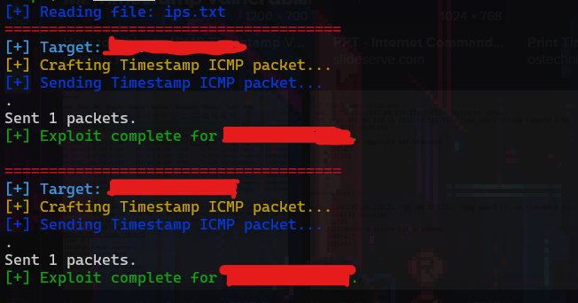

# ICMP-TimeStamp-Replay-3xploit-Scanner
This Bash script allows you to exploit the ICMP Timestamp Reply vulnerability by crafting and sending ICMP packets to target hosts. By leveraging weak time-based random number generators, this script can potentially disclose information from services vulnerable to this attack. Use it responsibly and with proper authorization.

## Description
The script crafts and sends ICMP packets to the specified targets, leveraging the potential vulnerability related to weak time-based random number generators.

### Usage
To run the script, execute it with root privileges using sudo or as the root user. Provide a file path as an argument to specify the targets.

~~~ bash
sudo bash exploit_timestamp_reply.sh <file_path>
~~~

### Requirements
- Root privileges
- Bash shell
- Python 3
- Scapy library
### Instructions
1. Ensure you have root privileges before running the script.
2. Specify the file path containing the list of targets (IP addresses or domains) as an argument.
3. The script will read the file and perform the exploit for each target.
4. It crafts a Timestamp ICMP packet using Scapy library.
5. The crafted packet is sent to the target using the Python 3 interpreter.
6. After sending the packet, the temporary files are cleaned up.
7. The script provides feedback on the exploit status for each target.
8. Upon completion, a message indicates the successful execution of the script.

| :memo:        | Note: Use this script responsibly and only on systems where you have proper authorization and permission to perform such actions.       |
|---------------|:------------------------|

*Feel free to modify and enhance the script according to your specific needs.*

